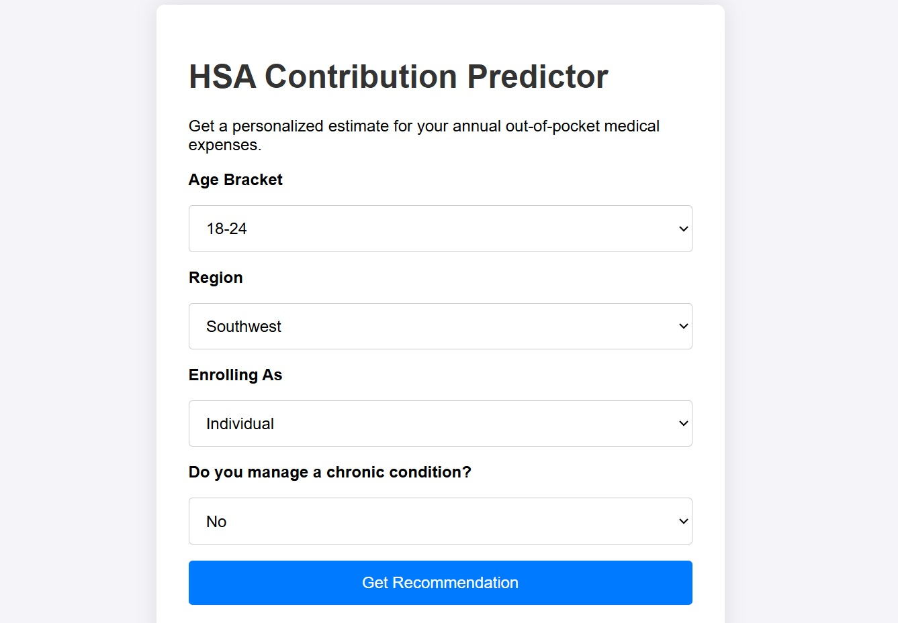
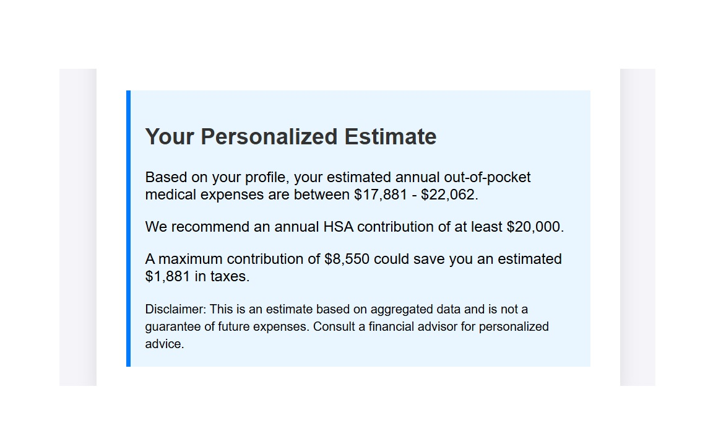

# Predictive Health Expense Modeling for HSA Contributions

This project is a full-stack web application designed to help users make informed decisions about their Health Savings Account (HSA) contributions. It uses a machine learning model to forecast a user's likely annual out-of-pocket medical expenses based on their profile, providing a data-driven recommendation to guide their financial planning during open enrollment.

-----

## Demo





-----

## Core Problem

During open enrollment, employees often guess how much to contribute to their HSA. Contributing too little results in missed tax benefits and uncovered medical costs, while contributing too much locks up cash that might be needed elsewhere. This tool aims to replace guesswork with a personalized, data-driven estimate.

-----

## Features ✨

  * **Personalized Predictions:** Users input non-identifiable information (age, region, family size, chronic condition status) to get a tailored expense forecast.
  * **ML-Powered Backend:** Utilizes a trained XGBoost regression model to predict expenses.
  * **Clear Recommendations:** Provides a suggested HSA contribution amount and calculates potential tax savings based on 2025 contribution limits.
  * **Interactive Frontend:** A clean and simple user interface built with HTML, CSS, and vanilla JavaScript.
  * **RESTful API:** A Flask-based backend serves the model's predictions via a `/predict` endpoint.

-----

## Technology Stack 💻

  * **Backend:** Python, Flask
  * **Machine Learning:** Scikit-learn, XGBoost, Pandas
  * **Frontend:** HTML, CSS, JavaScript
  * **Environment:** Python 3.11, Virtual Environment (`venv`)

-----

## Local Setup and Installation ⚙️

Follow these steps to get the project running on your local machine.

### 1\. Prerequisites

  * Git
  * Python 3.9+

### 2\. Clone the Repository

```bash
git clone https://github.com/your-username/hsa-predictor.git
cd hsa-predictor
```

### 3\. Create and Activate a Virtual Environment

This isolates the project's dependencies from your system.

  * **Windows:**
    ```bash
    python -m venv venv
    venv\Scripts\activate
    ```
  * **macOS / Linux:**
    ```bash
    python3 -m venv venv
    source venv/bin/activate
    ```

### 4\. Install Dependencies

Install all the required Python packages from the `requirements.txt` file.

```bash
pip install -r requirements.txt
```

### 5\. Train the Model

Run the training script to generate the `hsa_predictor_pipeline.pkl` model file.

```bash
python train.py
```

-----

## Usage 🚀

1.  **Start the Flask Server:**
    Run the main application file (ensure it's named `application.py` or `app.py` as needed).
    ```bash
    python application.py
    ```
2.  **Open the Application:**
    Once the server is running, open your web browser and navigate to:
    [http://12.0.0.1:5000](https://www.google.com/search?q=http://127.0.0.1:5000)

-----

## Project Structure

```
hsa-predictor/
├── .gitignore
├── README.md
├── application.py             # Main Flask application
├── hsa_predictor_pipeline.pkl # Trained model (generated by train.py)
├── insurance.csv              # The dataset
├── requirements.txt           # Python dependencies
├── train.py                   # Script to train and save the ML model
└── static/
    ├── index.html             # Frontend HTML
    ├── script.js              # Frontend JavaScript for API calls
    └── style.css              # Frontend CSS
```
